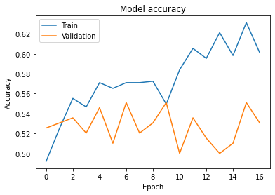

# Return direction prediction using LSTM
## Problem statement
The problem of return prediction is one of the current points of interest in the financial world. The aim of this project is to forecast the returns of Meta stock based on the last 7 days of price and volume data for three stocks from the same industry – Amazon, Intel and Meta itself. 
## Model and Data
One of the most widely used models for forecasting of time series data is Long-Short-Term-Memory model. It is a recurring neural network model, that can store information over some period of time. This feature allows the model to account for patterns in time series data, which makes it a good model for returns predictions. In order to work with LSTM, tensorflow and keras libraries in Python are used. Tensorflow will be used for creating generators when working with time series data, while keras will help to build NN models.
The data for this study is taken from Nasdaq website and includes 5 years of daily stock prices and volumes for three chosen assets. 
## Conclusion
The best model has the following parameters: LSTM size is 10, dropout is 0.00 and learning rate is 0.007525. This model provides validation accuracy of approximately 0.61.
A validation loss of 0.761428 indicates the average error between the predicted and actual class probabilities on the validation set at a specific point in training. Lower values indicate better performance, but the value itself doesn’t directly represent accuracy; rather, it measures the “fit” of predicted probabilities.

In general, a low validation loss means the model’s predictions closely match the actual labels for the validation set.
A high validation loss may imply poor generalization, which could result from underfitting (model not learning enough) or overfitting (model too specialized to the training data and not performing well on new data).

---

This project is part of assignment for Big Data as a partial fulfillment of Master of Science in Finance Analytics at King's College London